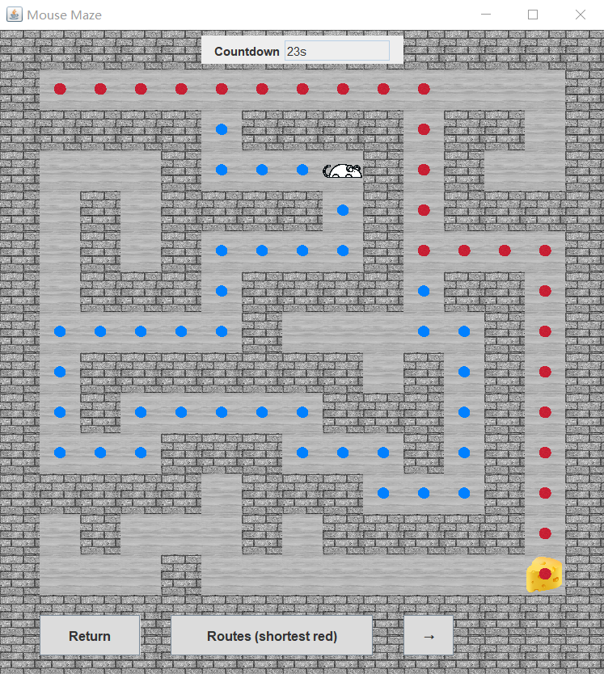

# Project Introduction
This is a project of the *Data Structure* course in my freshman year, which I recently reconstructed using the **Maven** framework.

A starving mouse (at the entrance) is trying to get the cheese (at the exit) in a maze. Try to reach the cheese before time runs out! Also, <font color="#ff0000">red</font> dots show the shortest path, and <font color="#245bdb">blue</font> dots demonstrate the rest.

This project focuses on the **DFS** algorithm to find the right way.

# How to Run
1. Make sure you are done with your **Maven** environment configuration.
2. Directly run the `EnterPanel.java`, which contains the `main` function.

# Interface Demonstration


# Contents
```
mouse-maze/
├── src/
│   ├── main/
│   │   ├── java/    // java files
│   │   └── resources/
│   │       └── static/
│   │           ├── images/    // pics to draw the panels
│   │           └── original-mazes/    // txts contain the initial maze maps
├── target/
├── output
│   └── my-mazes/    // txts contain your own maps (after editing)
├── pom.xml
├── report.docx    // my project report (2022.07)
└── README.md
```
# What's More
For more information, please refer to the `report.docx` in the repository.

The images should not be used for commercial purposes.

There might be a few bugs since it was born from a freshman :) Have fun and feel free to add more functions!